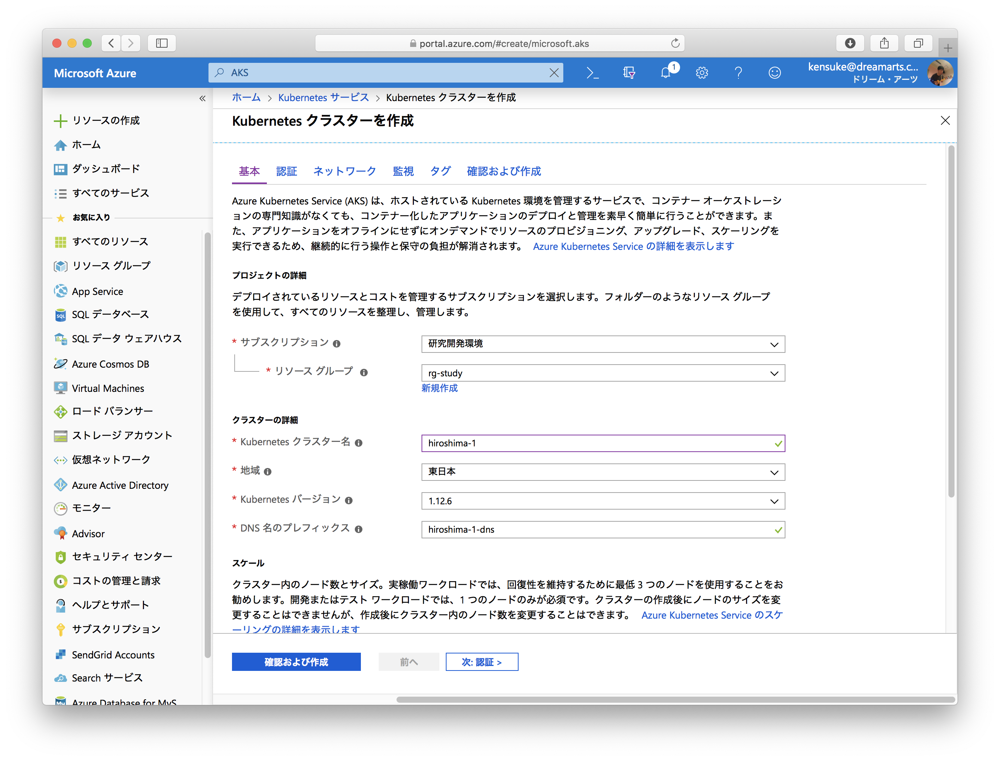

# AKSクラスタの作成 (事前に実施済みです)



## Azule CLI (az) のインストール

### CentOS7の場合
```
sudo rpm --import https://packages.microsoft.com/keys/microsoft.asc
```
```
udo ssh -c 'echo -e "[azure-cli]\nname=Azure CLI\nbaseurl=https://packages.microsoft.com/yumrepos/azure-cli\nenabled=1\ngpgcheck=1\ngpgkey=https://packages.microsoft.com/keys/microsoft.asc" > /etc/yum.repos.d/azure-cli.repo'
```
```
sudo yum install azure-cli
```
```
az login
```

- Azureポータルにアクセス可能な認証・認可を持っているブラウザで、表示されたURLにアクセスしトークンを入力する。
- ~/.azure 以下にAzureのアクセストークンが保存される

## 利用するサブスクリプションを選択する

```
az account list --output table
```

利用するサブスクリプションのIDを確認して

```
az account set --subscription "サブスクリプションのIDか名前"
```

確認のためにリソースグループの情報を取得してみる

```
az group show --name {リソースグループ名}
```

## kubectl の接続先を設定する
azコマンドを利用してAKSに接続可能な認証情報を ```~/.kube/config``` に書き込む
```
az aks get-credentials --resource-group rg-study --name {AKSクラスタ名}
```

## 接続できたことを確認する
```
kubectl get all
```
